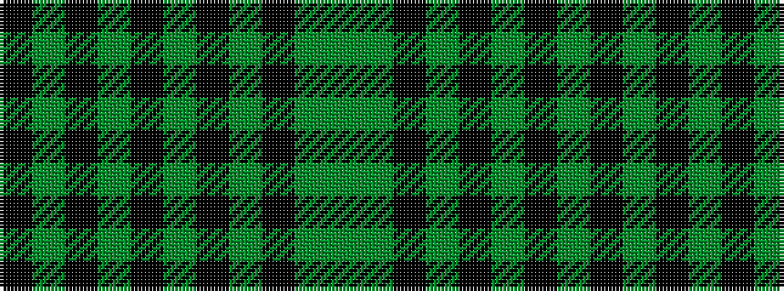

GGKGKGKGKGK

It is a 11 stripe tartan.

<figure class="pat-woven">

<figcaption>idealised sample</figcaption>
</figure>

## Colour Sequence



## Tartans with this colour sequence

| Tartans |
|---------------|
| [Phillips (Welsh Name)](/variants/s11/k2dg20k30dg2k4dg2k30dg3k30dg35dg2/)|
||
