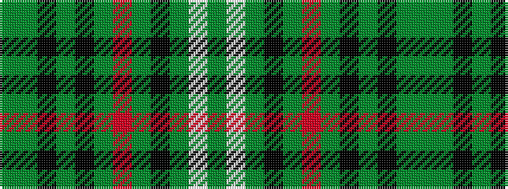

GGKGKGRGKGWG

It is a 12 stripe tartan.

<figure class="pat-woven">

<figcaption>idealised sample</figcaption>
</figure>

## Colour Sequence



## Tartans with this colour sequence

| Tartans |
|---------------|
| [Wilcox, Yu, Cruikshank Reunion](/variants/s12/y3g12k5g2k5y2r2y2k5g12w2y3~x2/)|
||
