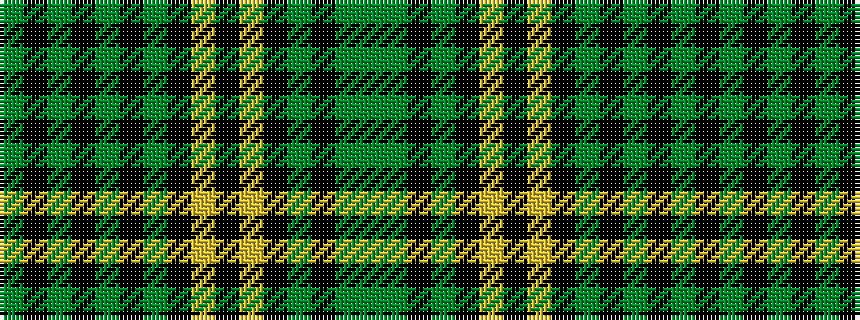

GGKGKYKYKGKGKGKG

It is a 16 stripe tartan.

<figure class="pat-woven">

<figcaption>idealised sample</figcaption>
</figure>

## Colour Sequence



## Tartans with this colour sequence

| Tartans |
|---------------|
| [Hope Vere / Weir](/setts/s16/dg19k1g3k1dg3k9dg20k1ly1k7ly1k1dg21k12dg2g1~x2/)|
||
