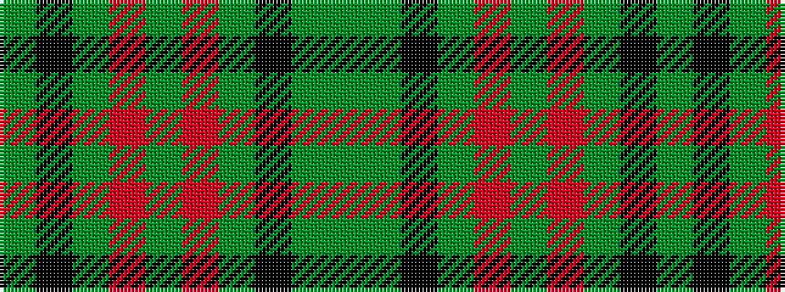

GGKGRGRGKG

It is a 10 stripe tartan.

<figure class="pat-woven">

<figcaption>idealised sample</figcaption>
</figure>

## Colour Sequence



## Tartans with this colour sequence

| Tartans |
|---------------|
| [Wilson's No.112 (Light Blue)](/setts/s10/dg12k14y11r3y3r3y11k14dg12y3~x2/)|
||
