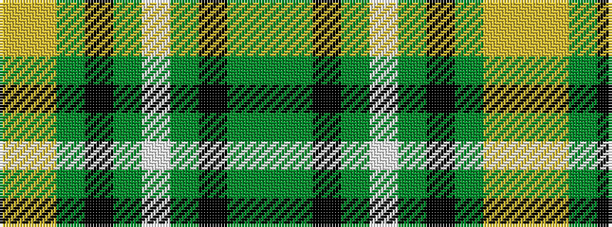

GGKGWGKGYY

It is a 10 stripe tartan.

<figure class="pat-woven">

<figcaption>idealised sample</figcaption>
</figure>

## Colour Sequence



## Tartans with this colour sequence

| Tartans |
|---------------|
| [Noble (South Africa) (Personal)](/variants/s10/lyi4ly3dg2k6dgi4w1dg12k10dgi2dg3~x2/)|
||
| [Noble (South Africa) (Personal)](/variants/s10/lyi4ly3dg2k6g4w1dg12k10g2dg3~x2/)|
||
