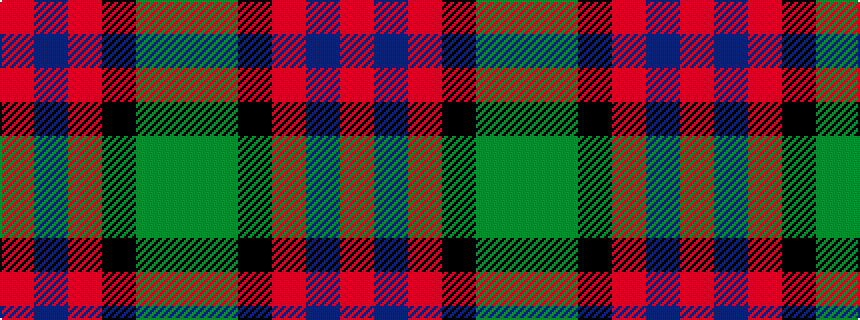

GGKRBR

It is a 6 stripe tartan.

<figure class="pat-woven">

<figcaption>idealised sample</figcaption>
</figure>

## Colour Sequence



## Tartans with this colour sequence

| Tartans |
|---------------|
| [MacWilliam (Clan)](/variants/s6/dy2g12k10r1b16r2~x4/)|
||
| [MacWilliam Clan Tartan](/variants/s6/dy2g12k10r1db16r2~x2/)|
||
| [MacWilliam Hunting](/variants/s6/dy2dg44k10r1db16r1~x2/)|
||
