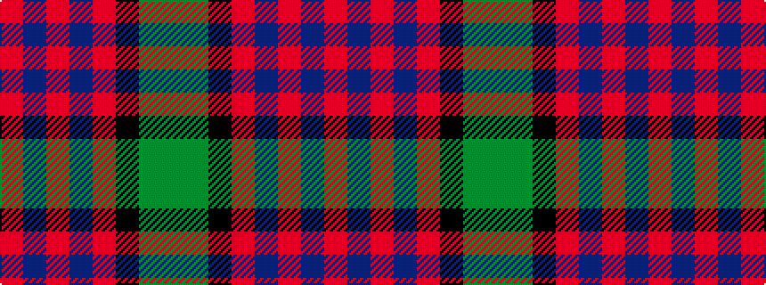

GGKRBRBR

It is a 8 stripe tartan.

<figure class="pat-woven">

<figcaption>idealised sample</figcaption>
</figure>

## Colour Sequence



## Tartans with this colour sequence

| Tartans |
|---------------|
| [MacWilliam](/variants/s8/dy2g12k10r1b16r2b16r1~x4/)|
||
