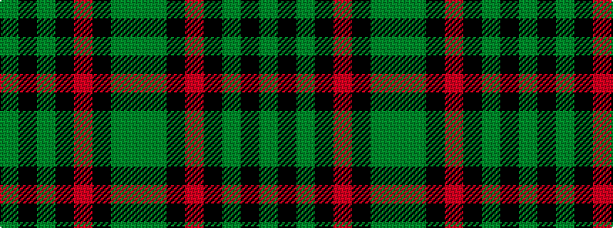

GGKRKGKG

It is a 8 stripe tartan.

<figure class="pat-woven">

<figcaption>idealised sample</figcaption>
</figure>

## Colour Sequence



## Tartans with this colour sequence

| Tartans |
|---------------|
| [Crane of Clunie](/variants/s8/g165k12g6k18r4k10g4y4/)|
||
