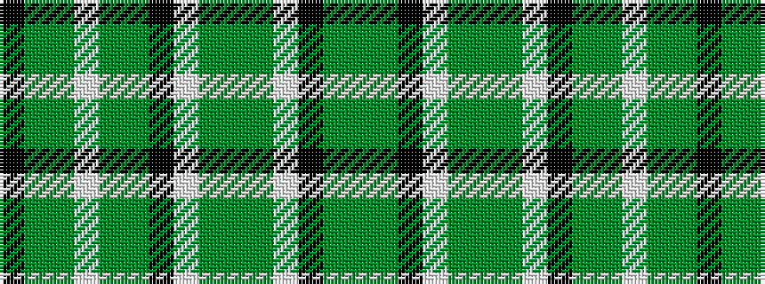

GGKWGGGWKGGWGGK

It is a 15 stripe tartan.

<figure class="pat-woven">

<figcaption>idealised sample</figcaption>
</figure>

## Colour Sequence



## Tartans with this colour sequence

| Tartans |
|---------------|
| [Gayre Dress](/variants/s15/y8g2k2w2g8y2g8w2k2gi3g2w2g1y2k2~x2/)|
||
