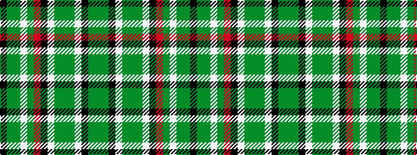

GGKWGGGWKRGWGGK

It is a 15 stripe tartan.

<figure class="pat-woven">

<figcaption>idealised sample</figcaption>
</figure>

## Colour Sequence



## Tartans with this colour sequence

| Tartans |
|---------------|
| [Gayre Dress (Clan)](/variants/s15/y14g4k4w4g12y4g12w4k4r6g4w4g3y4k4~x2/)|
||
