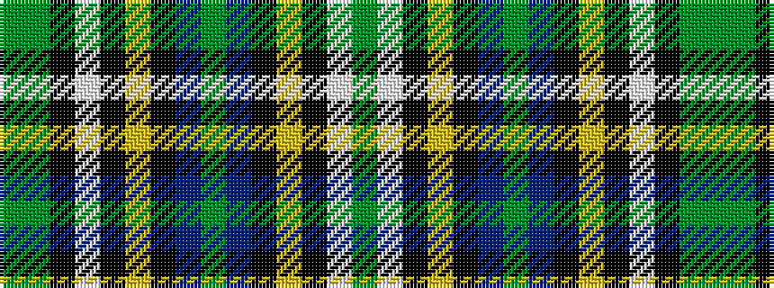

GGKWKYKBGBKYKWG

It is a 15 stripe tartan.

<figure class="pat-woven">

<figcaption>idealised sample</figcaption>
</figure>

## Colour Sequence



## Tartans with this colour sequence

| Tartans |
|---------------|
| [Massie/Massey](/variants/s15/dy29g17k1w3k1ly2k10t8dy4t8k10ly2k1w3dy29~x2/)|
||
