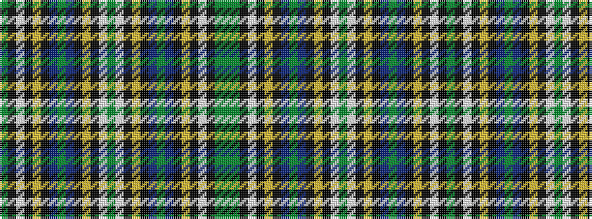

GGKWKYKBGBKYKWGWKYKBGBKYKWKG

It is a 28 stripe tartan.

<figure class="pat-woven">

<figcaption>idealised sample</figcaption>
</figure>

## Colour Sequence



## Tartans with this colour sequence

| Tartans |
|---------------|
| [Wilson's No.017 #2](/setts/s28/dy29g17k1w3k1ly2k10t8dy4t8k10ly2k1w3dy29~x2/)|
||
