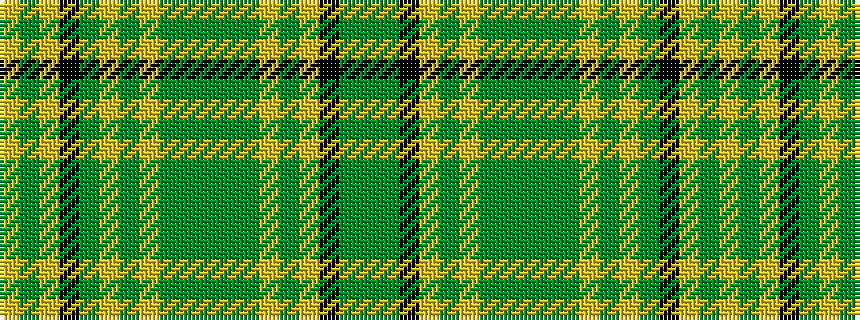

GGKYGYGGGGGYGYGKYGY

It is a 19 stripe tartan.

<figure class="pat-woven">

<figcaption>idealised sample</figcaption>
</figure>

## Colour Sequence



## Tartans with this colour sequence

| Tartans |
|---------------|
| [Shepherd, (Name)](/variants/s19/g40dy5k40lr8g1lr1g1dy2g1dy2g1lr1g1lr7g1k15lr5g1lr10~x2/)|
||
