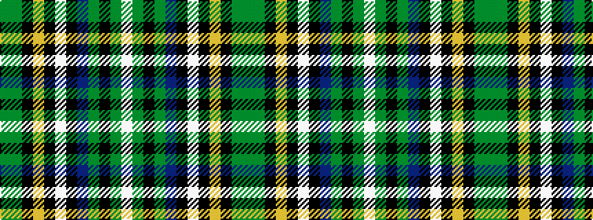

GGKYKWKBGKGW

It is a 12 stripe tartan.

<figure class="pat-woven">

<figcaption>idealised sample</figcaption>
</figure>

## Colour Sequence



## Tartans with this colour sequence

| Tartans |
|---------------|
| [Wcwm 9275-1258](/variants/s12/y8g2k4lo1k1lb1k1do8y3k1y1lb1~x4/)|
||
