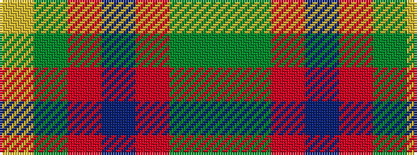

GGRBRGY

It is a 7 stripe tartan.

<figure class="pat-woven">

<figcaption>idealised sample</figcaption>
</figure>

## Colour Sequence



## Tartans with this colour sequence

| Tartans |
|---------------|
| [Tulloch Homes](/setts/s7/g6gi14r9dt7r9gi54ly6/)|
||
| [Tulloch Homes](/setts/s7/g6dg14r9dt7r9dg54ly6/)|
||
