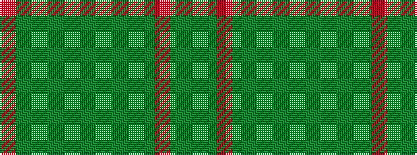

GGRGGGGGGGGGR

It is a 13 stripe tartan.

<figure class="pat-woven">

<figcaption>idealised sample</figcaption>
</figure>

## Colour Sequence



## Tartans with this colour sequence

| Tartans |
|---------------|
| [All Ireland Green (Fashion)](/setts/s13/g6g2r2g30y2g4y2dg2y1dg20y1g2r4~x2/)|
||
