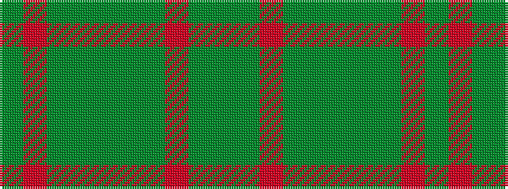

GGRGGGGGRG

It is a 10 stripe tartan.

<figure class="pat-woven">

<figcaption>idealised sample</figcaption>
</figure>

## Colour Sequence



## Tartans with this colour sequence

| Tartans |
|---------------|
| [Donachie of Brockloch Htg (Clan)](/setts/s10/y24r2y2dg40y25dg2y2r2y2dg20~x2/)|
||
| [Donachie of Brockloch Hunting Clan Tartan Tartan Number: 3002. Earliest known date: 2004 Based on the Robertson sett No. 893 with red changed to green. The Donachie's are part of the Robertson clan, also known as Clan Donnachaidh. See products available Copyright © Blair Urquhart, Comrie, 2015](/setts/s10/dgi24r2dgi2dg40dgi25dg2dgi2r2dgi2dg20~x2/)|
||
