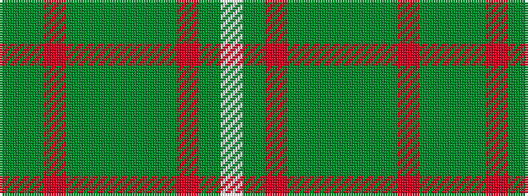

GGRGGGGGRGW

It is a 11 stripe tartan.

<figure class="pat-woven">

<figcaption>idealised sample</figcaption>
</figure>

## Colour Sequence



## Tartans with this colour sequence

| Tartans |
|---------------|
| [Harmony 14](/variants/s11/g3yi16o11yi2y11yi2y11yi2o11yi16w3~x2/)|
||
