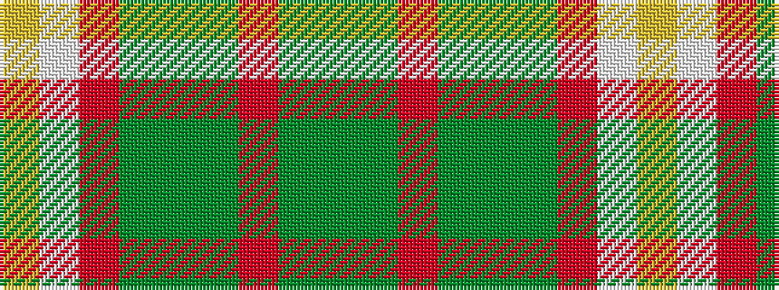

GGRGGGRWY

It is a 9 stripe tartan.

<figure class="pat-woven">

<figcaption>idealised sample</figcaption>
</figure>

## Colour Sequence



## Tartans with this colour sequence

| Tartans |
|---------------|
| [Stirling](/setts/s9/dg2g1o1dg1g1g1o1w1lr2~x20/)|
||
