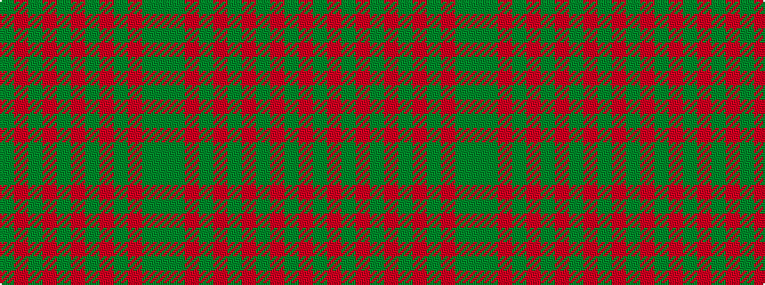

GGRGRGRGRGRG

It is a 12 stripe tartan.

<figure class="pat-woven">

<figcaption>idealised sample</figcaption>
</figure>

## Colour Sequence



## Tartans with this colour sequence

| Tartans |
|---------------|
| [Maple Leaf](/variants/s12/dg6r1dg1r4g4r4dg1r1dg6o2g2y4~x8/)|
||
