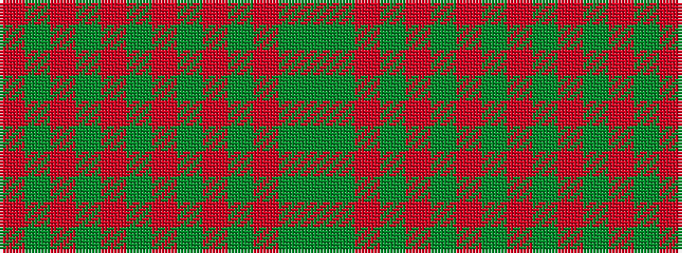

GGRGRGRGRGRGR

It is a 13 stripe tartan.

<figure class="pat-woven">

<figcaption>idealised sample</figcaption>
</figure>

## Colour Sequence



## Tartans with this colour sequence

| Tartans |
|---------------|
| [All Irish Green Irish District Tartan](/variants/s13/gi6g2r2gi30o2g4o2dg2o1dg20o1g2r4~x2/)|
||
