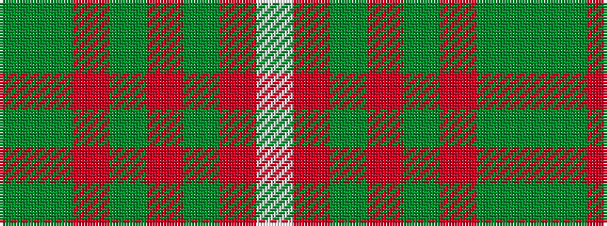

GGRGRGRW

It is a 8 stripe tartan.

<figure class="pat-woven">

<figcaption>idealised sample</figcaption>
</figure>

## Colour Sequence



## Tartans with this colour sequence

| Tartans |
|---------------|
| [Unidentified from Winnipeg](/setts/s8/w24r8dy2r8dy2r8dyi15dg2~x2/)|
||
