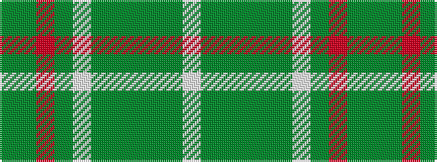

GGRGWGGGGGW

It is a 11 stripe tartan.

<figure class="pat-woven">

<figcaption>idealised sample</figcaption>
</figure>

## Colour Sequence



## Tartans with this colour sequence

| Tartans |
|---------------|
| [Williams](/setts/s11/dyi46dy6r3dy3w3dy3dg10dyi8dy3dyi6w3~x2/)|
||
