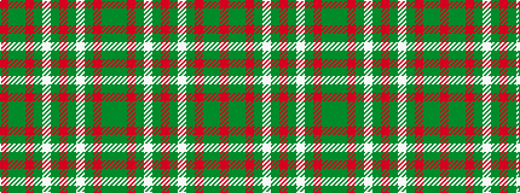

GGRGWGRGWGRGGR

It is a 14 stripe tartan.

<figure class="pat-woven">

<figcaption>idealised sample</figcaption>
</figure>

## Colour Sequence



## Tartans with this colour sequence

| Tartans |
|---------------|
| [Scott Hunting](/variants/s14/dy16g10r3g3lb2g3r3g3lb2g3r3g10dy16r3~x2/)|
||
