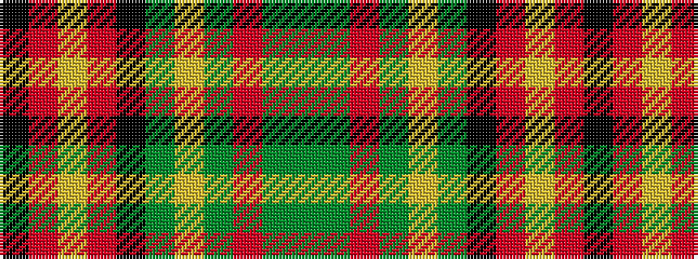

GGRGYGKRYRK

It is a 11 stripe tartan.

<figure class="pat-woven">

<figcaption>idealised sample</figcaption>
</figure>

## Colour Sequence



## Tartans with this colour sequence

| Tartans |
|---------------|
| [Chelsea](/setts/s11/k4o30ly3o3k6dg36ly1dg2r2dg2g2~x4/)|
||
