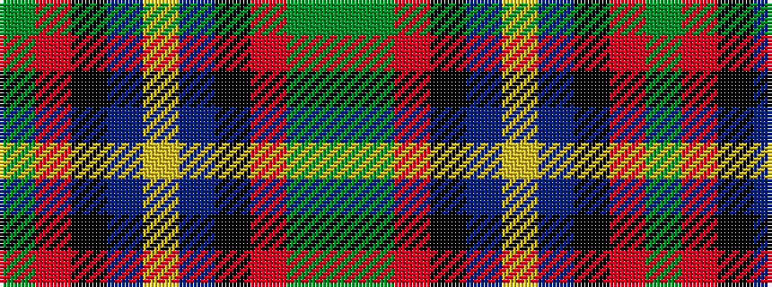

GGRKBYBKRG

It is a 10 stripe tartan.

<figure class="pat-woven">

<figcaption>idealised sample</figcaption>
</figure>

## Colour Sequence



## Tartans with this colour sequence

| Tartans |
|---------------|
| [MacLeod Society of Scotland Clan Tartan](/variants/s10/g3r22k5dt22ly2dt22k5r22g3gi3~x2/)|
||
