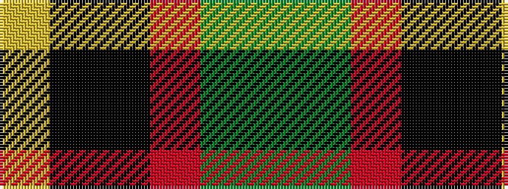

GGRKKY

It is a 6 stripe tartan.

<figure class="pat-woven">

<figcaption>idealised sample</figcaption>
</figure>

## Colour Sequence



## Tartans with this colour sequence

| Tartans |
|---------------|
| [Clan MacLeod Society of Scotland, Centenary](/variants/s6/dg3g3r22k5ki22ly2~x2/)|
||
