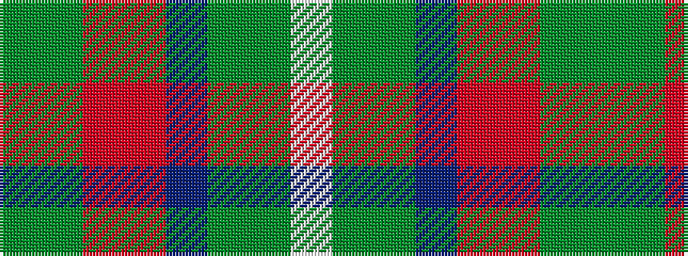

GGRRBGGW

It is a 8 stripe tartan.

<figure class="pat-woven">

<figcaption>idealised sample</figcaption>
</figure>

## Colour Sequence



## Tartans with this colour sequence

| Tartans |
|---------------|
| [The Climb (Fashion)](/variants/s8/y2dg9ri16r2b30y3dg6lb1~x2/)|
||
