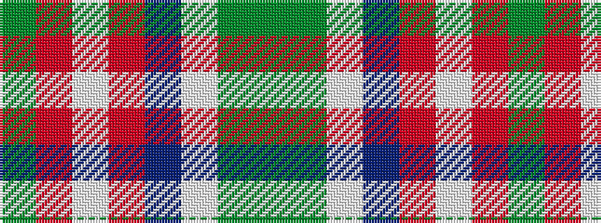

GGWBRWRG

It is a 8 stripe tartan.

<figure class="pat-woven">

<figcaption>idealised sample</figcaption>
</figure>

## Colour Sequence



## Tartans with this colour sequence

| Tartans |
|---------------|
| [Southwell (Australian) (Personal)](/setts/s8/g39r2w1r2db14w14g2g10~x2/)|
||
