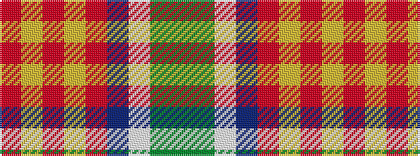

GGWBRYRYR

It is a 9 stripe tartan.

<figure class="pat-woven">

<figcaption>idealised sample</figcaption>
</figure>

## Colour Sequence



## Tartans with this colour sequence

| Tartans |
|---------------|
| [Nickel Lodge Centennial](/variants/s9/o16ly1o2ly1o2dt6w4dy1dg6~x2/)|
||
| [Nickel Lodge Centennial (Corporate)](/variants/s9/o36ly2o1ly2o4dt12w8dy2dg12~x2/)|
||
| [Nickel Lodge Centennial Corporate Tartan](/variants/s9/o18ly1o2ly1o2db6w4dy1g6~x2/)|
||
