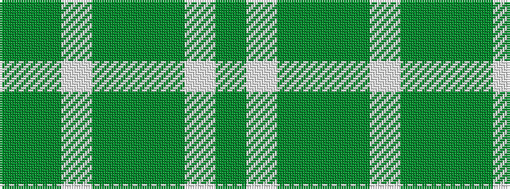

GGWGGGWG

It is a 8 stripe tartan.

<figure class="pat-woven">

<figcaption>idealised sample</figcaption>
</figure>

## Colour Sequence



## Tartans with this colour sequence

| Tartans |
|---------------|
| [Longniddry, Green](/setts/s8/g42g2w2g2g5dg12w32g4~x2/)|
||
