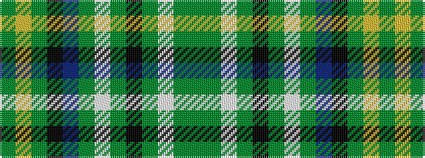

GGWGKGWGBKGYG

It is a 13 stripe tartan.

<figure class="pat-woven">

<figcaption>idealised sample</figcaption>
</figure>

## Colour Sequence



## Tartans with this colour sequence

| Tartans |
|---------------|
| [Knox (Personal)](/setts/s13/dg55y20w2y3k2y3w2y3db18k2y4ly2y3~x2/)|
||
