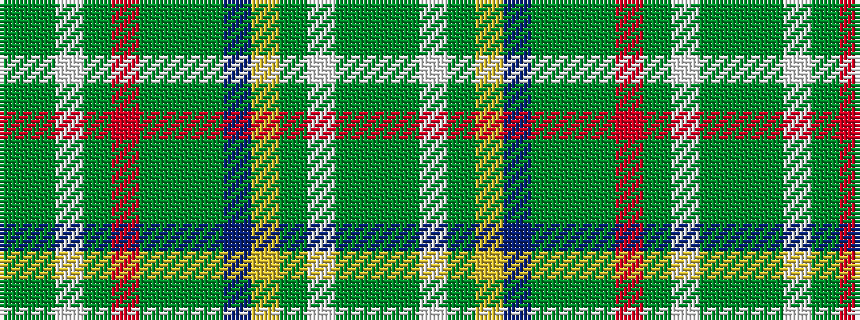

GGWGRGGGBYGWGG

It is a 14 stripe tartan.

<figure class="pat-woven">

<figcaption>idealised sample</figcaption>
</figure>

## Colour Sequence



## Tartans with this colour sequence

| Tartans |
|---------------|
| [Scott Hunting special](/setts/s14/dg8dg2w2dg6ly2db14dg4dg16dg16r2dg5w2dg4dg7/)|
||
| [Scott, hunting special](/setts/s14/g8dg2w2dg6ly2db14g4dg16g16r2g5w2g4dg7/)|
||
