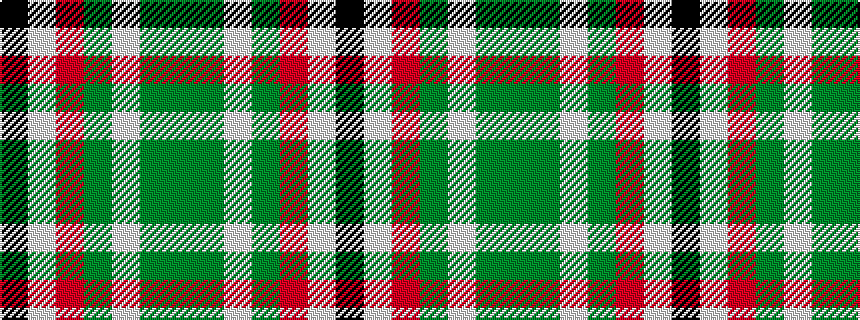

GGWGRWK

It is a 7 stripe tartan.

<figure class="pat-woven">

<figcaption>idealised sample</figcaption>
</figure>

## Colour Sequence



## Tartans with this colour sequence

| Tartans |
|---------------|
| [Hackett (Personal)](/variants/s7/k20w4r4gi20w5gi2g2~x2/)|
||
