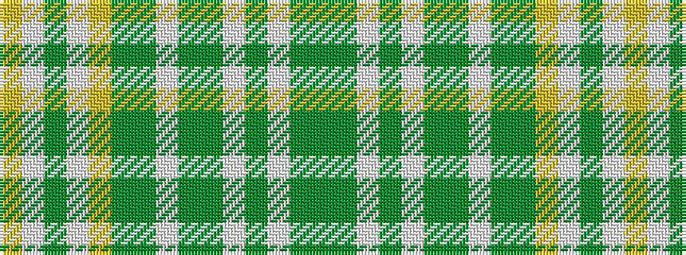

GGWGWGGWGGYWGWY

It is a 15 stripe tartan.

<figure class="pat-woven">

<figcaption>idealised sample</figcaption>
</figure>

## Colour Sequence



## Tartans with this colour sequence

| Tartans |
|---------------|
| [Isle of Skye (Fashion)](/setts/s15/dy8g1lb6dy8lb3dy4g1lb8g1dy6lo20lb29dy3lb7lo7~x2/)|
||
