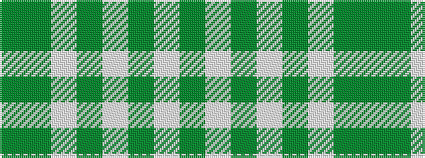

GGWGWGWG

It is a 8 stripe tartan.

<figure class="pat-woven">

<figcaption>idealised sample</figcaption>
</figure>

## Colour Sequence



## Tartans with this colour sequence

| Tartans |
|---------------|
| [Bundy, Dress Black Personal)](/variants/s8/g1g1w1g15w15g1w1g1~x4/)|
||
| [Jubilation Tartan](/variants/s8/g8w2g11w13g30w13g11g2~x2/)|
||
