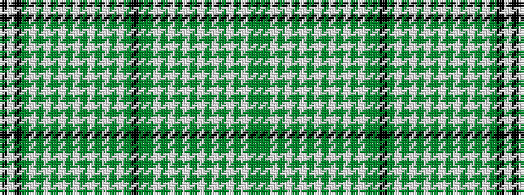

GGWGWGWGWGWGWGWGGKGWGWGWGWGWGWGWGKWK

It is a 36 stripe tartan.

<figure class="pat-woven">

<figcaption>idealised sample</figcaption>
</figure>

## Colour Sequence



## Tartans with this colour sequence

| Tartans |
|---------------|
| [British Columbia (Commemorative)](/setts/s36/k50w16k8dg8w1dg1w1dg1w1dg1w1dg1w1dg1w1dg1w20dg40k12dg24g8w1g1w1g1w1g1w1g1w1g1w1g1w28g6dg4/)|
||
