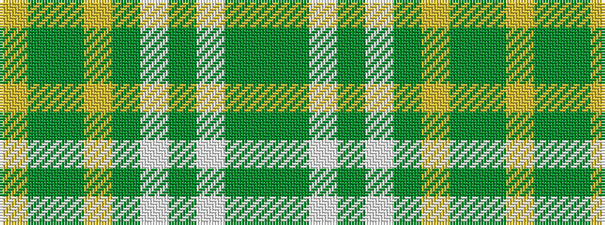

GGWGWGYGGY

It is a 10 stripe tartan.

<figure class="pat-woven">

<figcaption>idealised sample</figcaption>
</figure>

## Colour Sequence



## Tartans with this colour sequence

| Tartans |
|---------------|
| [Carter (Savannah) (Personal)](/setts/s10/dy4gi26lb1gi2lb2dy4lg26dy4g3ly3~x2/)|
||
