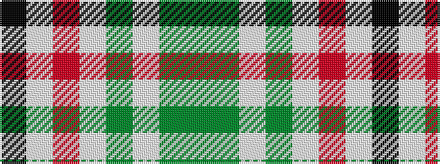

GGWGWRWK

It is a 8 stripe tartan.

<figure class="pat-woven">

<figcaption>idealised sample</figcaption>
</figure>

## Colour Sequence



## Tartans with this colour sequence

| Tartans |
|---------------|
| [Hackett, William (Coatbridge) (Personal)](/setts/s8/k20w4r4w20dg20w5dg2g2~x2/)|
||
