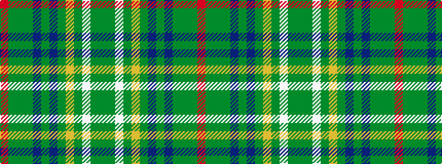

GGWGYGBGBGGGR

It is a 13 stripe tartan.

<figure class="pat-woven">

<figcaption>idealised sample</figcaption>
</figure>

## Colour Sequence



## Tartans with this colour sequence

| Tartans |
|---------------|
| [Hash House Harriers Hunting (Corp)](/variants/s13/g7dy1lb1dy1lo1dy7n7dy1n7dy7g7dy1r1~x4/)|
||
