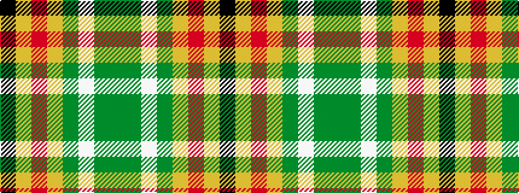

GGWGYRYK

It is a 8 stripe tartan.

<figure class="pat-woven">

<figcaption>idealised sample</figcaption>
</figure>

## Colour Sequence



## Tartans with this colour sequence

| Tartans |
|---------------|
| [Hackett Hunting (Personal)](/variants/s8/k20lo4r4lo20y20lb5y2g2~x2/)|
||
