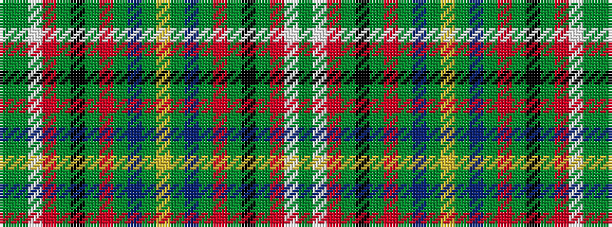

GGWRGKGRGBGYGBGRGKGRWG

It is a 22 stripe tartan.

<figure class="pat-woven">

<figcaption>idealised sample</figcaption>
</figure>

## Colour Sequence



## Tartans with this colour sequence

| Tartans |
|---------------|
| [Arizona American District Tartan](/variants/s22/dy3g2w2r2dy12k12g12r2g2t2g2ly2~x2/)|
||
