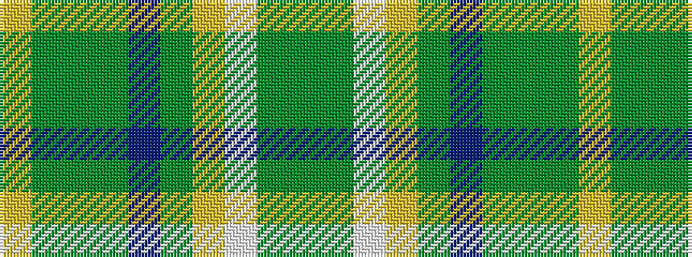

GGWYGBGGGY

It is a 10 stripe tartan.

<figure class="pat-woven">

<figcaption>idealised sample</figcaption>
</figure>

## Colour Sequence



## Tartans with this colour sequence

| Tartans |
|---------------|
| [Hayden (Dublin) (Personal)](/variants/s10/dgi60dg5w5lo5dg9dp4dg5dgi5dg1lo5~x2/)|
||
| [Hayden, Thomas (Personal)](/variants/s10/g60gi5w5ly5gi5p4gi5g5gi1ly5~x2/)|
||
