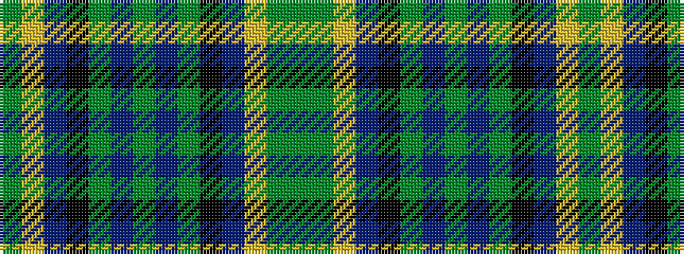

GGYBKGBGBGKBYG

It is a 14 stripe tartan.

<figure class="pat-woven">

<figcaption>idealised sample</figcaption>
</figure>

## Colour Sequence



## Tartans with this colour sequence

| Tartans |
|---------------|
| [St. Lawrence #2](/variants/s14/g2lo21do1k5g11do13g2do13g11k5do1lo21g2dy1~x2/)|
||
