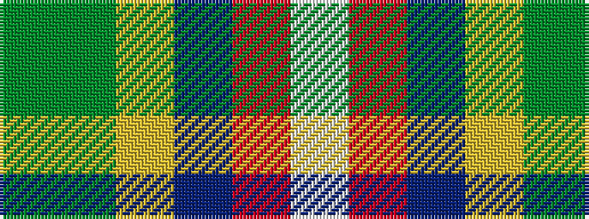

GGYBRW

It is a 6 stripe tartan.

<figure class="pat-woven">

<figcaption>idealised sample</figcaption>
</figure>

## Colour Sequence



## Tartans with this colour sequence

| Tartans |
|---------------|
| [Mekos, The](/variants/s6/dy19g23ly3db15r11w5~x2/)|
||
