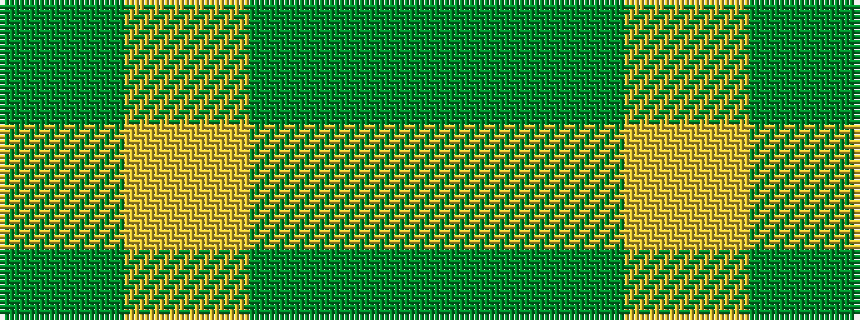

GGYG

It is a 4 stripe tartan.

<figure class="pat-woven">

<figcaption>idealised sample</figcaption>
</figure>

## Colour Sequence



## Tartans with this colour sequence

| Tartans |
|---------------|
| [Pasteur](/setts/s4/dy10ly1dy30y3~x4/)|
||
| [Pilgrims (Bedford)](/setts/s4/g3ly6dg4g2~x2/)|
||
