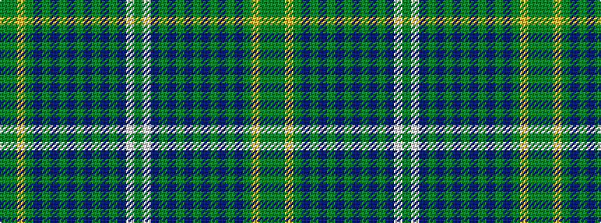

GGYGBGBGBGBGBGBWG

It is a 17 stripe tartan.

<figure class="pat-woven">

<figcaption>idealised sample</figcaption>
</figure>

## Colour Sequence



## Tartans with this colour sequence

| Tartans |
|---------------|
| [Prickly Thistle](/variants/s17/yi3y15ly3y3n1y1n1y1n1y1n1y1n1y1n12w15yi3~x2/)|
||
