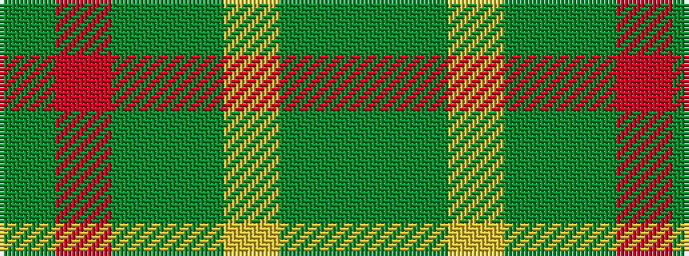

GGYGGRG

It is a 7 stripe tartan.

<figure class="pat-woven">

<figcaption>idealised sample</figcaption>
</figure>

## Colour Sequence



## Tartans with this colour sequence

| Tartans |
|---------------|
| [Doyle](/setts/s7/g24r9g4dg19ly2dg6g7~x2/)|
||
