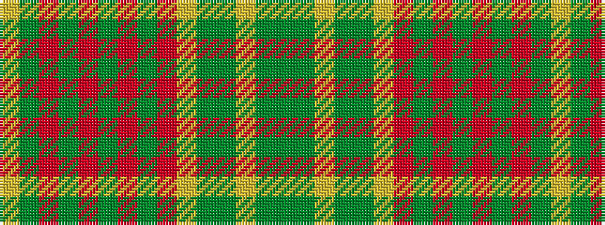

GGYGGYRGRGRGRGY

It is a 15 stripe tartan.

<figure class="pat-woven">

<figcaption>idealised sample</figcaption>
</figure>

## Colour Sequence



## Tartans with this colour sequence

| Tartans |
|---------------|
| [Prince David](/setts/s15/lo4g1o21g18o2g3o2g18o21lo2g1g3lo2g1g3~x2/)|
||
