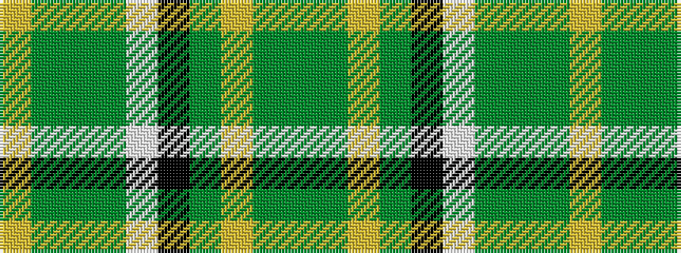

GGYGKWGGGY

It is a 10 stripe tartan.

<figure class="pat-woven">

<figcaption>idealised sample</figcaption>
</figure>

## Colour Sequence



## Tartans with this colour sequence

| Tartans |
|---------------|
| [Irish National](/setts/s10/g53dg5ly5dg9k5w5dg2g7dg1ly2~x2/)|
||
